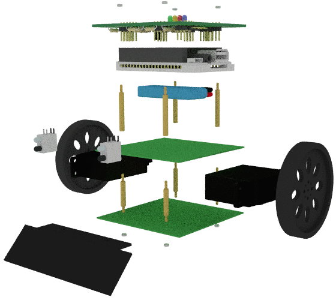
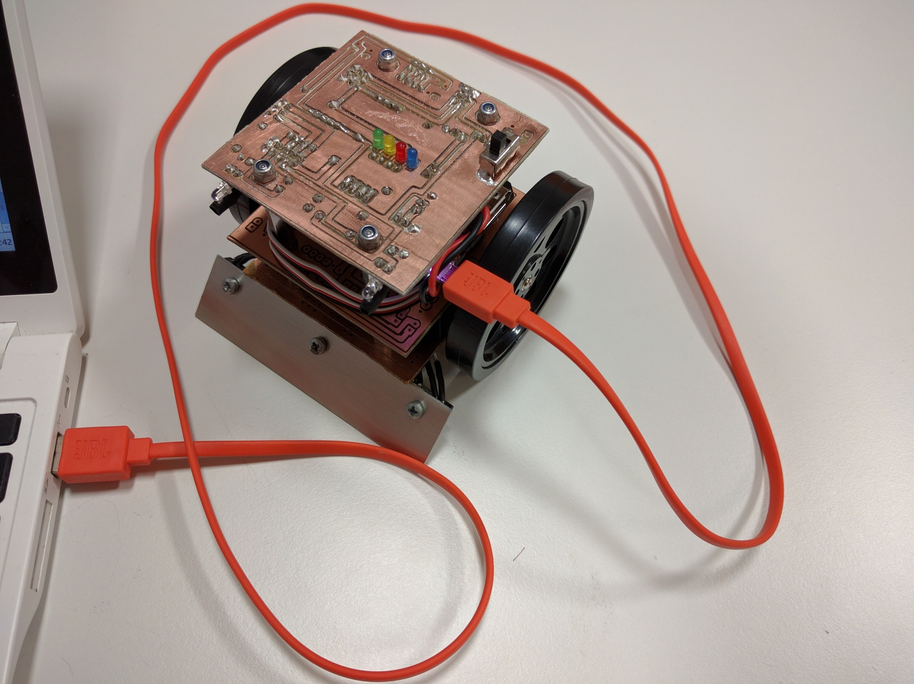

#SumoCHIP

SumoCHIP is an extremely low-budget robotics platform based on CHIP single-board
computer developed by [Robotics Club of Estonian IT College](http://robot.itcollege.ee).
SumoCHIP is designed for teaching soldering, electronics, programming
and networking.

##Documentation

Bill of materials, instructions for building the robot and setting up the software are available [here](doc/index.md).
Translations are very much welcome.
See below how you can contribute!

##Demo

This is how the robot looks like once assembled:

Here's a video of two sumorobots battling in the sumo ring:

##Kits

Being completely open hardware you can order the components and assemble the
robot yourself with the prices stated in the [bill of materials](doc/bom.md) page,
expect to spend around 30 USD per robot.
Robotics Club of Estonian IT College provides kits within EU which saves
you the hassle of purchasing invidual components online.

| Description                                                    | Price                         |
|----------------------------------------------------------------|-------------------------------|
| SumoCHIP PCB and solderable components only                    | 20 EUR + recommended donation |
| Everything except [C.H.I.P.](http://getchip.com/products/chip) | 40 EUR + recommended donation |
| All in one batteries included kit                              | 50 EUR + recommended donation |

When ordering please specify whether you want PCB to be soldered or not,
soldered board adds extra 10 EUR to the price. We can also ship custom
configurations of components.
Donations are used to renew the equipment of robotics club so we could continue doing cool stuff!

To order send us e-mail and we'll reply with an invoice PDF.
Within EU standard [SEPA](https://en.wikipedia.org/wiki/Single_Euro_Payments_Area)
payments are expected. Once payment is received the kits will be shipped with
standard mail services once a week.

##Software

The current implementation is based on Python and Flask.
In future we might add
[kernel module for generating fine grained PWM signals](https://github.com/tanzilli/soft_pwm)
to achieve better timing granularity for servo motors.

##Contributing

Improvements and translations are very much welcome.
The contents of this Git repository are published under very liberal [MIT license](LICENSE).
Just register an account here at GitHub and hit the Fork button in the top right corner,
this shall make a copy of the source code repository under your GitHub account.
Make the necessary modifications in your repository and once ready
make a [pull request](https://help.github.com/articles/about-pull-requests/)
to get your changes merged. All contributors shall be mentioned in [the contributors list](CONTRIBUTORS.md).
We don't expect you to sign a contributor license agreement,
but you should not forget that as this project is distributed under MIT license,
third parties or even us are free to make commercial use of any of the repository's contents.

##Known issues

We are aware of following issues:

* Do not attempt to power servo motors without having battery connected. The servos simply drain too many amps which causes CHIP to power off if the power is supplied only over USB cable. This will not damage CHIP or your computer's USB ports, this is simply USB ports safety mechanism to prevent overcurrent.
* Certain USB 3.0 enabled motherboards have trouble connecting to CHIP over USB cable or the connection is occasionally lost under Ubuntu. Try to disable USB 3.0 in BIOS.
* Enemy detection sensors in their current form are very sensitive. Ambient light, especially direct sunlight triggers the phototransistors making it nearly impossible to use the robots outdoors. Proper shielding of phototransistors with black shrinktubes is crucial, use blinds to cover direct sunlight if necessary. Alternative sensors would increase the price of the robot significantly, that's the main reason why we sticked to primitive infrared LED and phototransistor pair method.
* Under Ubuntu add your user account to `dialout` group, log out from your desktop session and log in again. Otherwise your user account is unable to make use of the serial connection to CHIP, resulting in error `cannot open /dev/ttyACM0`.
* Running `sumochip_test` while the web interface is running in the background causes jerky behaviour, stop web interface first `systemctl stop sumochip`.

Powering the robot:

* Powering CHIP up while power supply pins 3.3V or 5V are shorted to ground or to eachother will cause AXP209 power supply IC to die. Carefully examine with a multimeter that 3.3V, 5V and ground rails are not connected to eachother.
* Reversing the battery polarity irreversable damages AXP209 power supply IC on the CHIP. Be extra careful when connecting the battery.
* If the CHIP remains powered on only for few seconds or if AXP209 heats up too much then it's likely that AXP209 has been damaged by one of the ways mentioned above.

If you have fried your AXP209, you can try to replace it with a new one. Damaged AXP209 can lead to battery drainage which can lead to irreversible battery damage or in extreme cases make the battery explode.

##About

